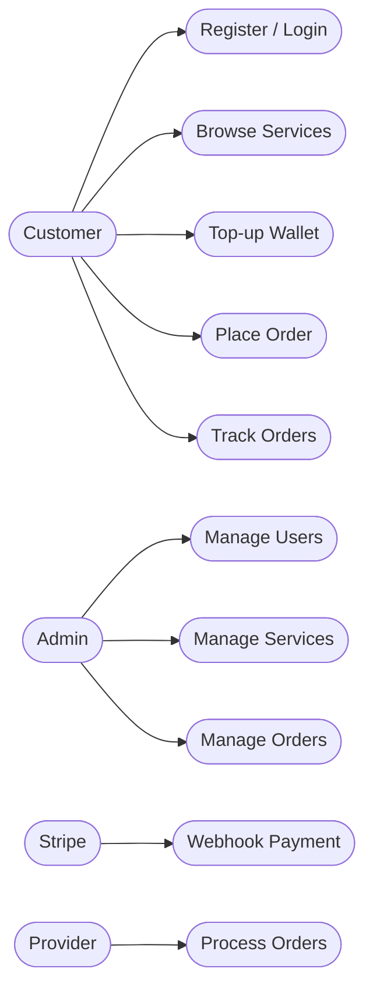
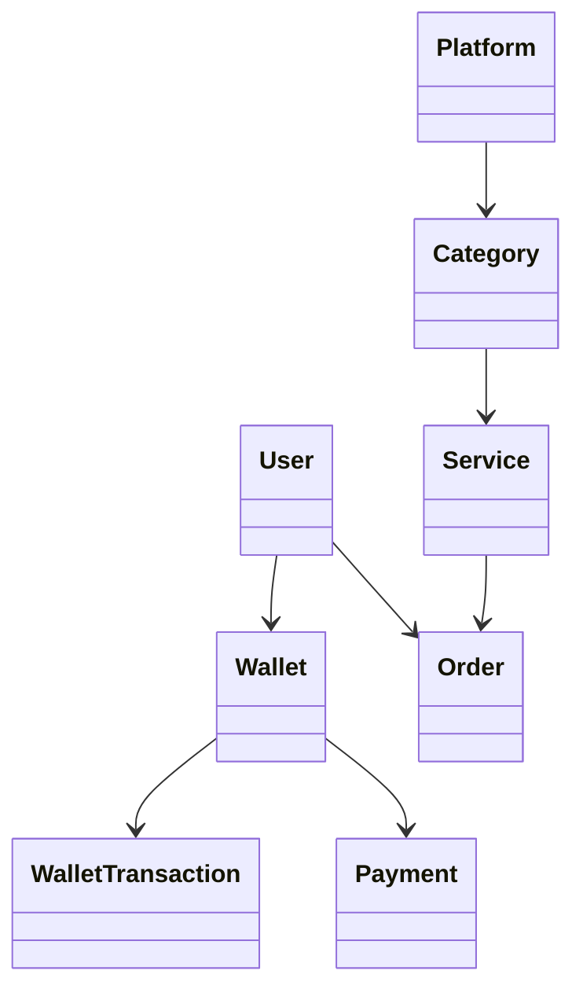
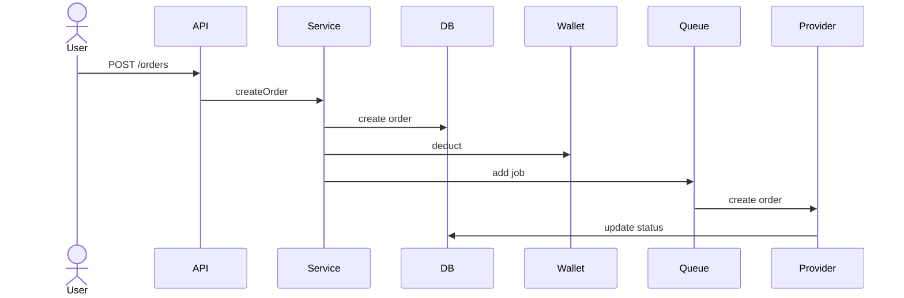
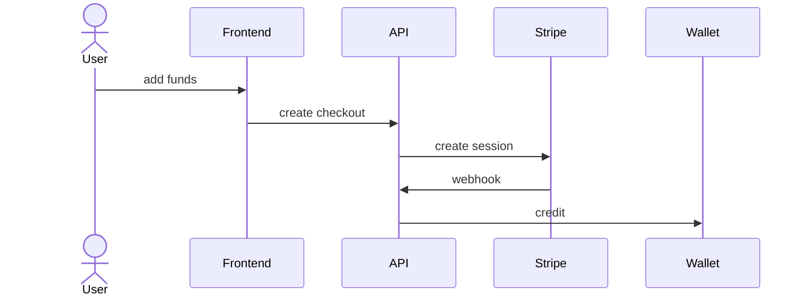
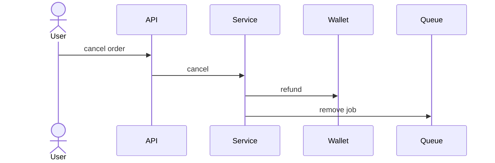

# Project Audit — Nexora (digital-mania-growth)

⚠️ You asked to benchmark against an MVP POS system. This codebase is **not a POS** — it is an SMM (Social Media Marketing) panel: users top up a wallet via Stripe and purchase provider-backed engagement services (followers, likes…).  
I report against that actual domain; a POS-gap section is included at the end.

---

## 1. Project Overview

A wallet-based marketplace that resells a third-party SMM provider's services.

Users:
- Browse platforms → categories → services
- Fund wallet via Stripe Checkout
- Place orders (async to provider)
- Track order status

Admins:
- Manage users
- Manage services
- Sync provider

---

## 2. Tech Stack (detected)

| Layer | Detected |
|------|--------|
| Frontend | React 18, Vite, TypeScript, React Router v6, TanStack Query v5, Tailwind, shadcn/Radix, framer-motion, react-hook-form |
| Backend | NestJS 11, TypeScript, Passport (JWT), Joi, class-validator, argon2 |
| DB / ORM | PostgreSQL, Prisma 6 |
| Queue / Cache | BullMQ 5, Redis (ioredis), @bull-board/api |
| Payments | Stripe 18 (Checkout + webhook) |
| External | SMM provider (axios: services, add, status, cancel, refill, balance) |
| Infra | Docker, docker-compose, Pino logging |
| Test | Vitest, Playwright (frontend only) |

---

## 3. Architecture (actual)

- **Style:** Modular Monolith (NestJS modules)
- **Cross-cutting:** CommonModule (rate-limit, cache, logger, interceptors)
- **Async:** BullMQ queues
  - ORDER_SUBMIT_QUEUE
  - ORDER_STATUS_UPDATE_QUEUE
- **Auth:** JWT + refresh token (httpOnly cookie)
- **Frontend:** SPA (React)
- **Data integrity:** Wallet uses atomic updates (Serializable isolation)

---

## 4. Modules & Features

| Module | Capability | Status |
|--------|-----------|--------|
| Auth | Register, login, refresh, logout | ✅ Done |
| Users | User service, admin bootstrap | ✅ Done |
| Wallet | Balance + transactions | ✅ Done |
| Payments | Stripe checkout + webhook | ✅ Done |
| Platforms | List platforms | ✅ Done |
| Categories | List categories | ✅ Done |
| Services | Catalog browsing | ✅ Done |
| Orders | Create, list, cancel orders | ✅ Done |
| Provider | External API integration | ✅ Done |
| Admin | Manage users/services/orders | 🟡 Partial |
| Health | Health check | ✅ Done |
| Tickets | Support system | ❌ Missing |
| Refill | Provider refill logic | 🟡 Partial |
| Security | 2FA, email verification | ❌ Missing |
| Admin UI | Frontend admin panel | ❌ Missing |

---

## 5. Database Models (Prisma)

- User  
- Wallet  
- WalletTransaction  
- Payment  
- Platform  
- Category  
- Service  
- Order  
- OrderStatusLog  
- QueueJobLog  
- AdminActionLog  

❌ Missing:
- Ticket
- Notification
- Refund
- ApiKey

---

## 6. Gaps & Issues

### Technical
- ❌ Tickets module incomplete
- ❌ No refill endpoint exposed
- ❌ No admin frontend
- ⚠️ Transaction isolation inconsistent
- ⚠️ Order enqueue after commit (risk of lost jobs)
- ❌ No idempotency (orders/payments)
- ❌ No retries / circuit breaker
- ❌ No backend tests
- ⚠️ Logs grow unbounded
- ❌ bull-board not mounted
- ❌ No soft-delete for services

---

## 7. POS Gap (Important)

This is **NOT a POS system**.

Missing:
- Stock / inventory
- SKUs / barcodes
- Checkout system (cart)
- Payment at counter
- Receipts
- Tax rules
- Discounts
- Refund system
- Multi-store support
- Reporting (Z/X)
- Offline mode

---

# UML

## Use Case Diagram

## Class diagram

## Sequence Diagram 1 — Place Order

## Sequence Diagram 2 — Stripe Payment

## Sequence Diagram 3 — Cancel Order
