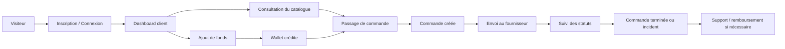
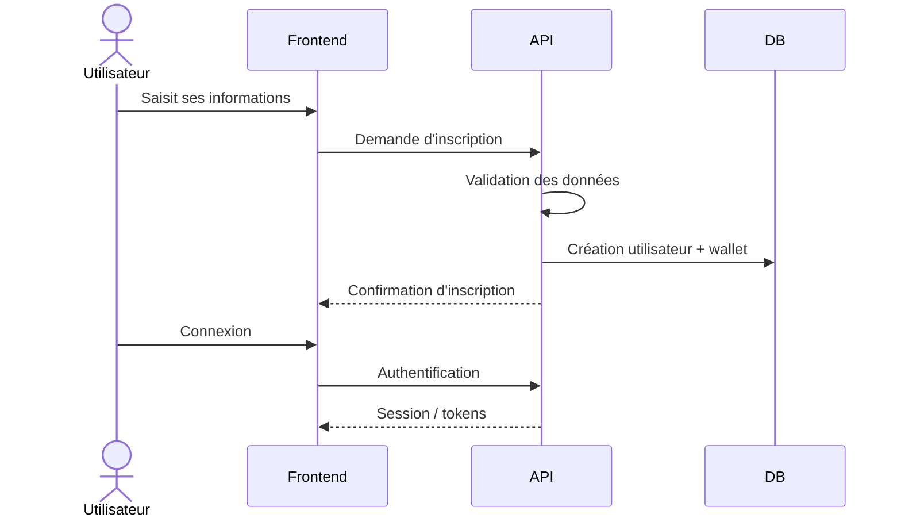
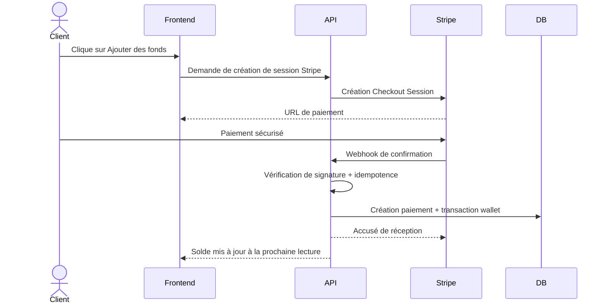
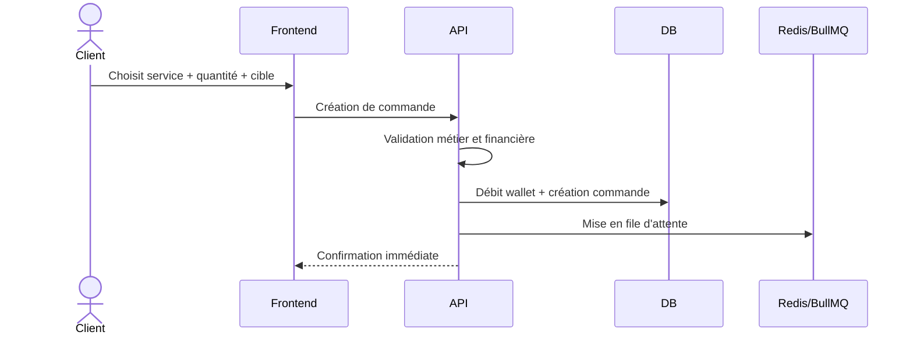
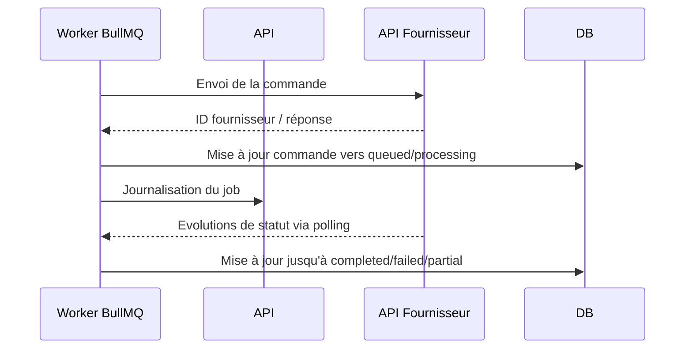
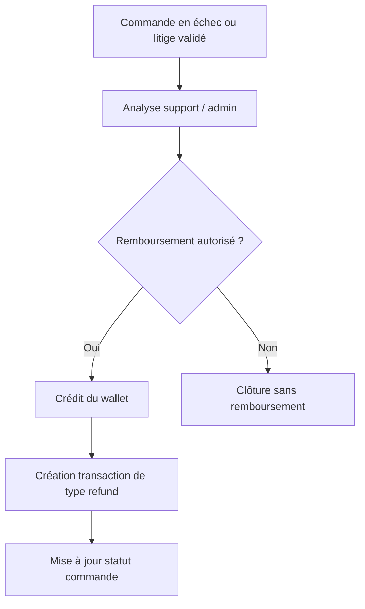
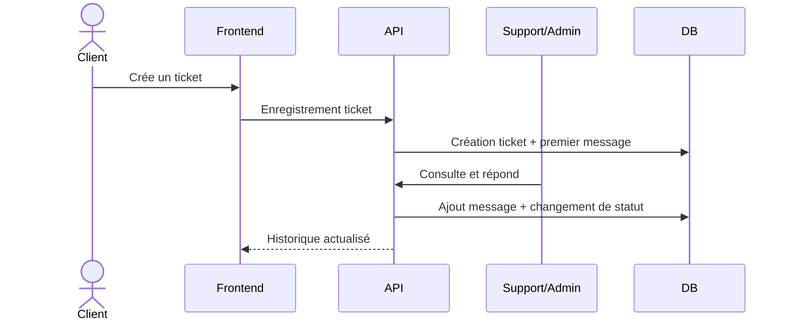
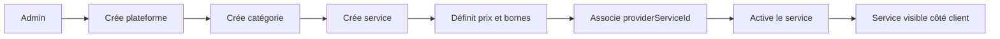
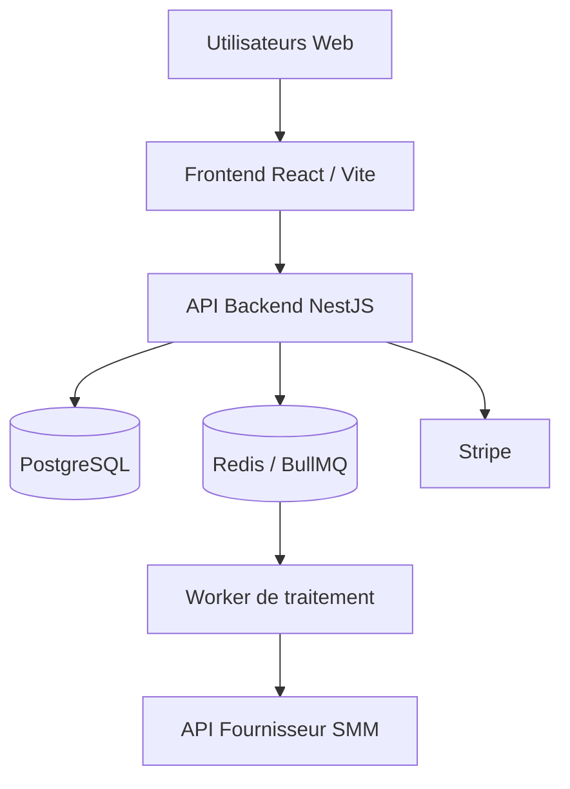
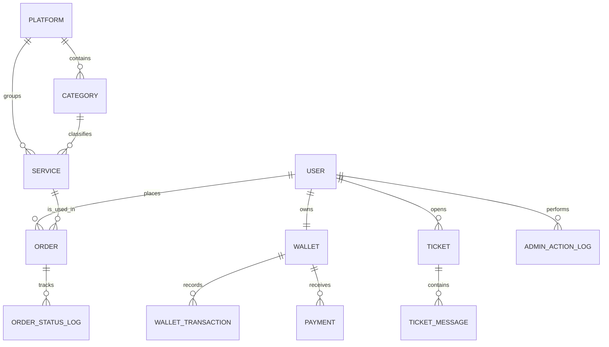

# Cahier des Charges Fonctionnel et Technique

**Projet :** Nexora  
**Type de produit :** Plateforme web de vente automatisée de services Social Media Marketing  
**Version du document :** 1.0  
**Statut :** Document de cadrage client  
**Confidentialité :** Confidentiel

---

## 1. Présentation du projet

### 1.1 Contexte
Nexora est une plateforme web permettant de commercialiser des services digitaux liés aux réseaux sociaux et à la visibilité en ligne, tels que les abonnés, likes, vues, commentaires ou trafic web. La plateforme s'adresse à des particuliers, créateurs, agences ou revendeurs qui souhaitent acheter rapidement des services standardisés depuis une interface simple et sécurisée.

Le système repose sur un modèle de revente automatisée :
- le catalogue affiché au client final est géré par l'administrateur de la plateforme ;
- chaque service local peut être relié à un service d'un fournisseur tiers via API ;
- le client crédite d'abord son portefeuille ;
- la commande est ensuite débitée automatiquement, envoyée au fournisseur et suivie jusqu'à son aboutissement.

### 1.2 Objectifs du projet
Les objectifs principaux de Nexora sont :
- fournir une expérience d'achat rapide, claire et mobile-friendly ;
- automatiser au maximum la prise de commande, le paiement, l'envoi au fournisseur et le suivi ;
- permettre au propriétaire de piloter les prix, les marges, le catalogue et les opérations ;
- garantir la traçabilité financière et opérationnelle ;
- réduire les interventions manuelles au strict minimum ;
- offrir une base technique évolutive, sécurisée et maintenable.

### 1.3 Résultats attendus
À l'issue du projet, le client doit disposer de :
- une plateforme web fonctionnelle en production ;
- un espace client complet ;
- un espace administrateur permettant l'exploitation quotidienne ;
- une architecture prête à monter en charge ;
- une documentation suffisante pour l'utilisation, la maintenance et l'évolution.

---

## 2. Vision produit

### 2.1 Proposition de valeur
Nexora doit permettre à un utilisateur de :
- créer un compte rapidement ;
- déposer de l'argent en ligne ;
- parcourir un catalogue de services organisé par plateforme et catégorie ;
- passer une commande en quelques étapes ;
- suivre l'état de ses commandes ;
- consulter l'historique de ses paiements, débits et remboursements ;
- contacter le support si un problème survient.

### 2.2 Cibles
La plateforme vise notamment :
- les particuliers cherchant des services simples et rapides ;
- les influenceurs et créateurs ;
- les agences marketing ;
- les revendeurs de services digitaux ;
- les équipes internes du propriétaire de Nexora pour l'administration et le support.

### 2.3 Principes d'expérience utilisateur
- Interface claire, moderne et rassurante.
- Parcours d'achat court.
- Informations financières toujours visibles.
- Temps de réponse rapides.
- Utilisation confortable sur mobile, tablette et desktop.
- Vocabulaire simple côté client, vocabulaire plus opérationnel côté administration.

---

## 3. Périmètre fonctionnel

### 3.1 Espace public
L'espace public comprend :
- page d'accueil / landing page ;
- présentation des services et bénéfices ;
- pages d'information légale ;
- accès à l'inscription et à la connexion ;
- éventuelles pages CMS simples : FAQ, contact, politique de confidentialité, CGU, CGV.

### 3.2 Espace client
L'espace client comprend :
- inscription et connexion ;
- gestion du profil ;
- tableau de bord ;
- consultation du solde du wallet ;
- rechargement du wallet ;
- navigation dans le catalogue ;
- création et validation d'une commande ;
- historique des commandes ;
- détail d'une commande ;
- historique financier ;
- création et suivi de tickets support.

### 3.3 Espace administrateur
L'espace administrateur comprend :
- gestion des utilisateurs ;
- gestion des rôles et droits ;
- gestion des plateformes, catégories et services ;
- liaison entre service local et service fournisseur ;
- définition des prix de vente et bornes de quantité ;
- activation / désactivation de services ;
- supervision des commandes ;
- gestion des remboursements wallet ;
- gestion du support ;
- consultation des journaux d'activité et d'audit ;
- suivi global des paiements, revenus et anomalies.

### 3.4 Intégrations externes
Le périmètre intègre :
- Stripe pour les paiements et webhooks ;
- un fournisseur SMM via API ;
- Redis / BullMQ pour le traitement asynchrone ;
- PostgreSQL pour la persistance ;
- envoi d'e-mails transactionnels selon le besoin fonctionnel.

---

## 4. Parties prenantes et rôles

### 4.1 Acteurs métier
- **Visiteur :** découvre l'offre et peut s'inscrire.
- **Client :** recharge son wallet, passe des commandes, consulte ses historiques, ouvre des tickets.
- **Support :** traite les tickets, suit certains incidents, accompagne les clients.
- **Administrateur :** gère les utilisateurs, les services, les prix, les remboursements et le pilotage opérationnel.
- **Super administrateur / Propriétaire :** contrôle l'ensemble du système et des paramètres critiques.

### 4.2 Matrice de responsabilités simplifiée
- Le client gère ses achats et son solde disponible.
- Le support gère la relation client et l'escalade des incidents.
- L'administrateur gère le catalogue, les prix, les remboursements internes et la supervision.
- Le système assure automatiquement les transactions, l'envoi au fournisseur et la journalisation.

---

## 5. Besoins fonctionnels détaillés

### 5.1 Authentification et gestion du compte
Le système doit permettre :
- l'inscription par e-mail et mot de passe ;
- la connexion sécurisée ;
- la gestion de session ;
- la déconnexion ;
- la gestion du profil utilisateur ;
- la réinitialisation de mot de passe si prévue au périmètre ;
- la gestion des rôles (`customer`, `support`, `admin`) ;
- le blocage ou bannissement d'un compte si nécessaire.

### 5.2 Dashboard client
Le tableau de bord client doit afficher au minimum :
- le solde disponible ;
- les commandes récentes ;
- les montants dépensés ;
- les derniers dépôts ;
- les statuts importants ;
- des accès rapides vers ajout de fonds, nouvelle commande et support.

### 5.3 Wallet et opérations financières
Le wallet est le coeur financier de la plateforme. Il doit permettre :
- d'afficher le solde en temps réel ;
- d'ajouter des fonds via Stripe ;
- d'enregistrer un dépôt validé ;
- de débiter une commande ;
- de rembourser une commande éligible dans le wallet ;
- de journaliser chaque mouvement financier ;
- d'empêcher toute double comptabilisation.

### 5.4 Catalogue des services
Le catalogue doit être structuré selon :
- une plateforme : Instagram, TikTok, YouTube, etc. ;
- une catégorie : Followers, Likes, Views, Comments, etc. ;
- un service précis : nom, description, prix, quantité minimum, quantité maximum, statut actif / inactif.

Chaque service doit pouvoir contenir :
- un prix de vente ;
- un identifiant de service fournisseur ;
- des contraintes de quantité ;
- des informations d'affichage ;
- éventuellement des consignes de saisie spécifiques.

### 5.5 Passage de commande
Le client doit pouvoir :
- choisir une plateforme ;
- choisir une catégorie ;
- choisir un service ;
- saisir une cible (URL, username ou autre entrée attendue) ;
- saisir une quantité ;
- voir le prix calculé avant validation ;
- valider la commande si son solde est suffisant.

Le système doit :
- vérifier la validité des données ;
- vérifier que le service est actif ;
- vérifier les bornes de quantité ;
- calculer le montant ;
- débiter le wallet ;
- créer la commande ;
- l'envoyer en file d'attente pour traitement fournisseur ;
- mettre à jour le statut dans le temps.

### 5.6 Suivi de commande
Le client doit pouvoir consulter :
- l'identifiant de commande ;
- le service acheté ;
- la cible ;
- la quantité ;
- le montant ;
- le statut ;
- la date de création ;
- l'historique des changements de statut.

Les statuts usuels sont :
- `pending`
- `queued`
- `processing`
- `completed`
- `failed`
- `refunded`
- `partial` si nécessaire selon le fournisseur

### 5.7 Support et tickets
Le module support doit permettre :
- de créer un ticket ;
- d'ajouter des messages ;
- de suivre le statut du ticket ;
- d'associer un ticket à une commande si besoin ;
- de permettre la réponse du support ou de l'admin ;
- de conserver l'historique des échanges.

### 5.8 Back-office d'administration
L'administration doit permettre :
- de créer et modifier plateformes, catégories et services ;
- de connecter les services locaux aux IDs fournisseurs ;
- de définir les prix ;
- d'activer ou désactiver des éléments du catalogue ;
- de consulter et filtrer les commandes ;
- d'ajuster le wallet d'un client ;
- de rembourser une commande dans le wallet ;
- de consulter les paiements ;
- de voir les journaux d'audit ;
- de contrôler les utilisateurs et leurs accès.

---

## 6. Workflows essentiels

Cette section formalise les flux métier indispensables au bon fonctionnement du produit.

### 6.1 Workflow global de la plateforme

### 6.2 Workflow d'inscription et d'accès

### 6.3 Workflow de rechargement du wallet via Stripe

Objectif : garantir qu'un paiement validé soit crédité une seule fois, même si la page utilisateur est fermée ou rechargée.

### 6.4 Workflow de passage de commande

### 6.5 Workflow de traitement fournisseur

### 6.6 Workflow de remboursement

### 6.7 Workflow de support

### 6.8 Workflow d'administration du catalogue

---

## 7. Exigences fonctionnelles par module

### 7.1 Module Auth
- Sécurisation par mot de passe hashé.
- Gestion des rôles.
- Contrôle d'accès aux routes privées.
- Sessions d'authentification côté API et frontend.

### 7.2 Module Wallet
- Un wallet par utilisateur.
- Historique immuable des transactions.
- Types de transactions : `deposit`, `charge`, `refund`, `adjustment`.
- Cohérence transactionnelle forte.

### 7.3 Module Payments
- Création de sessions Stripe.
- Réception des webhooks.
- Vérification de signature.
- Prévention des doublons.
- Archivage des métadonnées de paiement.

### 7.4 Module Catalogue
- Gestion des plateformes.
- Gestion des catégories.
- Gestion des services.
- Gestion de la disponibilité et des prix.

### 7.5 Module Orders
- Création de commande.
- Validation de quantité et cible.
- Débit du wallet.
- Envoi en queue.
- Suivi de statut.
- Journal des statuts.

### 7.6 Module Provider
- Paramétrage URL et clé API.
- Mapping entre services locaux et services fournisseur.
- Journal des appels externes.
- Gestion des échecs, retries et supervision.

### 7.7 Module Support
- Tickets.
- Messages.
- Statuts.
- Liaison optionnelle avec commande.

### 7.8 Module Administration
- Gestion des utilisateurs.
- Ajustements manuels.
- Remboursements wallet.
- Audit des actions sensibles.

---

## 8. Architecture technique cible

### 8.1 Vue d'ensemble

### 8.2 Frontend
Technologies prévues :
- React 18
- Vite
- TypeScript
- Tailwind CSS
- shadcn/ui
- React Query
- react-hook-form
- zod
- react-router-dom

Le frontend doit :
- être responsive ;
- séparer les pages publiques, client et admin ;
- gérer les appels API, le cache et les formulaires ;
- offrir des tableaux, filtres et interfaces de suivi simples à exploiter.

### 8.3 Backend
Technologies prévues :
- NestJS 11
- TypeScript
- Prisma ORM
- JWT pour l'authentification
- BullMQ pour les traitements asynchrones

Le backend doit :
- exposer une API propre et sécurisée ;
- structurer le code par domaines fonctionnels ;
- centraliser la logique métier ;
- garantir les transactions financières ;
- gérer les appels aux services externes.

### 8.4 Base de données
Technologies prévues :
- PostgreSQL
- Prisma

La base doit :
- conserver les données métier ;
- historiser les opérations financières ;
- historiser les statuts de commandes ;
- conserver les logs d'administration et de jobs.

### 8.5 File d'attente et asynchrone
Technologies prévues :
- Redis
- BullMQ

Le système asynchrone doit :
- prendre en charge l'envoi fournisseur ;
- permettre les retries ;
- éviter les blocages côté utilisateur ;
- tracer les erreurs techniques.

---

## 9. Modèle de données essentiel

### 9.1 Diagramme conceptuel simplifié

### 9.2 Entités principales
- **User** : compte utilisateur, rôle, informations d'accès.
- **Wallet** : portefeuille financier unique.
- **WalletTransaction** : journal immuable des mouvements.
- **Payment** : trace des paiements Stripe.
- **Platform** : réseau ou grande famille de services.
- **Category** : regroupement métier.
- **Service** : offre commerciale détaillée.
- **Order** : commande passée par un client.
- **OrderStatusLog** : historique des changements de statut.
- **Ticket** : dossier de support.
- **TicketMessage** : messages dans le ticket.
- **QueueJobLog** : trace technique des jobs asynchrones.
- **AdminActionLog** : audit des actions administratives.

---

## 10. Règles métier essentielles

- Un utilisateur possède un seul wallet.
- Une commande ne peut être créée que si le solde est suffisant.
- Le débit wallet et la création de commande doivent être atomiques.
- Un paiement Stripe confirmé ne doit jamais être crédité deux fois.
- Un service inactif ne doit pas pouvoir être commandé.
- Les bornes min/max de quantité doivent être respectées.
- Toute action financière doit être tracée.
- Toute action sensible d'administration doit être auditée.
- Les échecs fournisseur doivent être visibles et exploitables.
- Le remboursement s'effectue dans le wallet sauf règle contraire décidée contractuellement.

---

## 11. Exigences non fonctionnelles

### 11.1 Sécurité
- Chiffrement HTTPS obligatoire.
- Mots de passe hashés de manière sécurisée.
- Secrets stockés via variables d'environnement.
- Protection des routes par rôle.
- Validation stricte des entrées.
- Journalisation des actions sensibles.
- Limitation du risque de double traitement par idempotence et transactions.

### 11.2 Performance
- Réponses rapides sur les écrans principaux.
- Cache applicatif pour certaines lectures.
- Chargement progressif des tableaux volumineux si nécessaire.
- Traitements externes déportés en file d'attente.

### 11.3 Fiabilité
- Tolérance aux échecs temporaires du fournisseur.
- Retries configurables sur les jobs.
- Logs techniques exploitables.
- Conception évitant les pertes d'événements critiques.

### 11.4 Maintenabilité
- Architecture modulaire.
- Code typé.
- séparation claire frontend / backend / infrastructure.
- documentation technique et fonctionnelle.

### 11.5 Scalabilité
- Déploiement possible sur serveur ou conteneurs.
- Base de données et Redis séparables.
- Possibilité d'ajouter plusieurs workers si le volume augmente.

---

## 12. Exigences légales et conformité

- Mise à disposition de pages légales : CGU, CGV, politique de confidentialité.
- Collecte limitée aux données strictement nécessaires.
- Aucun stockage direct des cartes bancaires côté application.
- Utilisation d'un prestataire conforme pour l'encaissement en ligne.
- Gestion des consentements et informations légales selon le pays d'exploitation du client.

---

## 13. Administration, supervision et reporting

L'application doit offrir au minimum :
- un tableau de bord d'exploitation ;
- un suivi des commandes par statut ;
- une visibilité sur les paiements et remboursements ;
- un historique des ajustements wallet ;
- une vue sur les tickets ouverts ;
- une consultation des logs d'administration ;
- une consultation des logs de jobs asynchrones ;
- des indicateurs de base : chiffre déposé, chiffre consommé, nombre de commandes, incidents.

---

## 14. Environnements et hébergement

### 14.1 Environnements recommandés
- développement ;
- préproduction / staging ;
- production.

### 14.2 Hébergement cible
L'hébergement peut reposer sur :
- un VPS sécurisé ;
- ou une architecture conteneurisée Docker ;
- avec reverse proxy Nginx ;
- certificat SSL ;
- base PostgreSQL ;
- instance Redis ;
- mécanisme de sauvegarde.

### 14.3 Variables d'environnement principales
Le système prévoit notamment :
- configuration serveur (`NODE_ENV`, `PORT`, `API_PREFIX`) ;
- configuration frontend (`FRONTEND_URL`) ;
- connexion base de données (`DATABASE_URL`) ;
- connexion Redis ;
- secrets JWT ;
- configuration Stripe ;
- configuration du fournisseur SMM ;
- niveau de logs et paramètres de cache.

---

## 15. Recette et critères d'acceptation

### 15.1 Critères d'acceptation fonctionnels
Le produit sera considéré conforme si les scénarios suivants fonctionnent :
- un utilisateur peut s'inscrire et se connecter ;
- un wallet est créé automatiquement ;
- un paiement Stripe validé crédite correctement le wallet ;
- le client peut consulter le catalogue ;
- le client peut passer une commande avec un solde suffisant ;
- la commande est enregistrée et envoyée au fournisseur ;
- les statuts remontent correctement ;
- un admin peut créer ou modifier un service ;
- un admin peut rembourser un client dans son wallet ;
- un ticket support peut être créé et traité ;
- les logs financiers et administratifs sont présents.

### 15.2 Jeux de tests à prévoir
- test de paiement réussi ;
- test de webhook reçu plusieurs fois ;
- test de commande avec solde insuffisant ;
- test de commande avec quantité invalide ;
- test d'échec fournisseur ;
- test de remboursement ;
- test de bannissement utilisateur ;
- test de permissions admin / support / client.

---

## 16. Livrables attendus

Le client doit recevoir :
- le code source frontend ;
- le code source backend ;
- le schéma de base de données / Prisma ;
- les fichiers de configuration nécessaires ;
- la documentation d'installation ;
- la documentation administrateur ;
- le présent cahier des charges validé ;
- les accès de production selon le mode de livraison convenu.

---

## 17. Planning projet recommandé

### 17.1 Phases
1. Cadrage fonctionnel et validation du besoin.
2. Conception UX/UI et architecture.
3. Mise en place de la base technique.
4. Développement du socle auth, wallet et catalogue.
5. Développement du tunnel de commande et de l'intégration fournisseur.
6. Développement du back-office.
7. Tests, recette et corrections.
8. Déploiement production.
9. Garantie post-livraison.

### 17.2 Jalons
- Validation du cahier des charges.
- Validation des maquettes ou parcours.
- Validation de l'architecture.
- Démonstration du MVP.
- Recette fonctionnelle.
- Mise en production.

---

## 18. Garantie et maintenance

### 18.1 Garantie post-livraison
Une période de garantie applicative peut être prévue contractuellement pour corriger les anomalies bloquantes ou régressions constatées après mise en production.

### 18.2 Maintenance évolutive
Une maintenance optionnelle peut couvrir :
- correctifs techniques ;
- mises à jour de sécurité ;
- évolution du catalogue et du back-office ;
- amélioration des performances ;
- ajout de nouveaux fournisseurs ou moyens de paiement ;
- ajout de reporting avancé.

---

## 19. Recommandations de diagrammes à conserver dans la version finale client

Pour une version client complète et exploitable, les diagrammes suivants sont essentiels :
- diagramme de vision globale de la plateforme ;
- diagramme d'inscription / connexion ;
- diagramme de recharge wallet via Stripe ;
- diagramme de passage de commande ;
- diagramme de traitement fournisseur ;
- diagramme de remboursement ;
- diagramme de support ;
- diagramme d'administration du catalogue ;
- diagramme d'architecture technique globale ;
- diagramme entité-relation simplifié de la base.

Ces diagrammes permettent de sécuriser la compréhension du projet côté client, équipe produit, développement et exploitation.

---

## 20. Conclusion

Le projet Nexora doit être conçu comme une plateforme transactionnelle automatisée, centrée sur la fiabilité financière, la simplicité d'usage et la maîtrise opérationnelle. Le succès du projet dépend de trois éléments majeurs :
- une expérience utilisateur claire ;
- une automatisation robuste des flux de paiement et de commande ;
- une administration complète permettant au propriétaire de piloter son activité sans dépendance technique quotidienne.

Ce cahier des charges constitue une base de référence pour la conception, le développement, la recette et la mise en production du produit.
