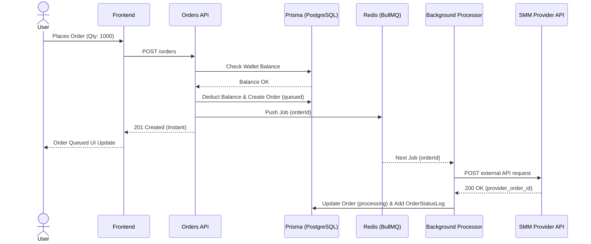
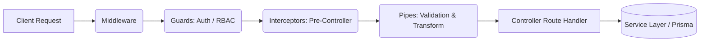
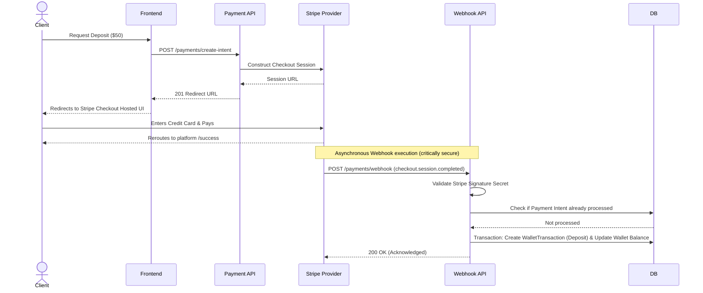

# Backend Architecture

## 1. Overview

The Nexora backend is constructed using **NestJS**, an enterprise-grade Node.js framework. The system embraces Object-Oriented Programming (OOP) principles, Dependency Injection (DI), and Domain-Driven Design (DDD) concepts by clustering specific features into isolated `Modules`.

**Core Stack:**
- **Framework:** NestJS 11
- **Language:** TypeScript
- **Database Access:** Prisma ORM
- **Background Tasks:** BullMQ & Redis

## 2. Module Boundaries

The backend architecture is intrinsically divided into feature modules hosted within `/backend/src`:

| Module | Responsibility |
|--------|----------------|
| **Auth** | Manages JWT issuance, Passport.js strategies, password hashing (Argon2), and login controllers. |
| **Users** | Handles user profile queries safely abstracted away from auth routines. |
| **Wallet** | Central controller for financial queries. Strictly ensures atomic behavior during balance reads and deductions. |
| **Payments** | Integrates with Stripe. Generates Checkout Sessions. Most critically, exposes and validates the Stripe Webhook handler to definitively credit wallets securely. |
| **Platforms / Categories / Services** | Classic CRUD abstractions exposing the catalog. Read-heavy. |
| **Orders** | Controls order placement. Orchestrates balance deductions and hooks into the Bull queue system. |
| **Provider** | An adapter layer. Receives standard internal payloads and formats them for outbound APIs (SMM panels) to deliver the service. |
| **Admin** | Isolated controllers injected with elevated Guards tracking administrative commands (updates catalogs, manages refunds) logging to `AdminActionLog`. |
| **Tickets** | Customer support routing. |
| **Health** | Infrastructure liveness and readiness probing. |

## 3. Asynchronous Execution Workflows

One of the platform's core tenants is instantaneous API responses. When a user submits an `Order`, they do not wait for the outbound SMM provider API to acknowledge the request natively.

### 3.1 SMM Order Delivery Workflow

1. **Submission:** the `OrdersService` confirms funds, deducts the Wallet incrementally mapping to Prisma `$transaction`, and logs an `OrderStatus` of `queued`.
2. **Queuing:** A job containing the `OrderId` is pushed to the BullMQ Redis queue. The HTTP Request cleanly terminates with `201 Created`.
3. **Execution:** An isolated NestJS `@Processor()` intercepts the queued job asynchronously. 
4. **Adapter Execution:** The Processor utilizes the `ProviderService` to dial the external provider. Based on the 200/400 outbound response, the Processor logs a success/failure locally and advances the database `OrderStatusLog` (e.g., to `failed` initiating a refund, or `processing`).

## 4. Security & NestJS Request Lifecycle

NestJS operates on a precise execution lifecycle that ensures security and data sanitation before the Controller logic ever executes.

- **Guards:** API endpoints are locked dynamically using custom Guards (e.g. `@UseGuards(JwtAuthGuard, RolesGuard)`).
- **Pipes:** The system heavily utilizes NestJS **Validation Pipes** bounded to `class-validator`/`class-transformer`. Incoming JSON payload strings are meticulously transformed into real instantiated JS Classes and validated against business rules (e.g. string lengths, UUID validations) before hitting the Controller.

## 5. Stripe Webhook & Wallet Top-up Flow

Wallet funding must be flawlessly atomic to prevent double-spending or lost deposits.

