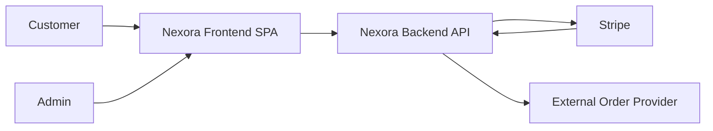
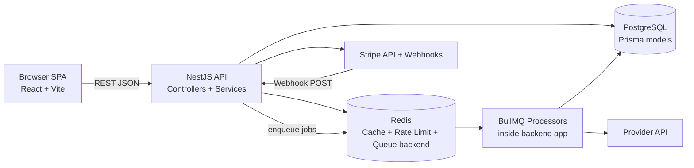
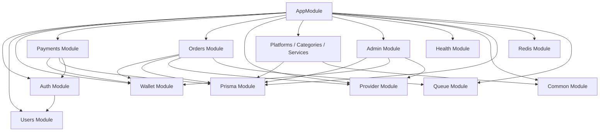
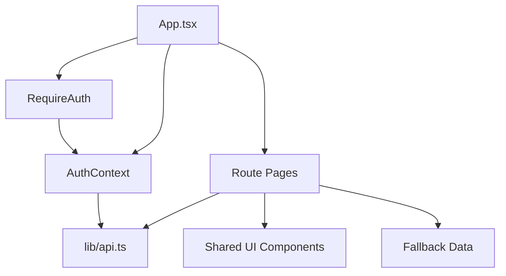

# C4-Style Architecture

This document uses a lightweight C4-style view of the current system.

## Level 1: System Context

### Responsibilities

- Customers browse services, fund wallets, and place orders.
- Admins manage catalog data and operational workflows.
- The frontend is the browser-delivered user interface.
- The backend enforces business rules, persistence, queueing, and integrations.
- Stripe handles hosted checkout and webhook delivery.
- The external provider fulfills and reports order status.

## Level 2: Container View

### Containers

#### 1. Frontend SPA

- Location: repository root `src/`
- Entry points: `src/main.tsx`, `src/App.tsx`
- Main responsibilities:
  - route rendering
  - auth/session storage
  - calling REST endpoints
  - redirecting users to Stripe Checkout

#### 2. Backend API

- Location: `backend/src/`
- Entry points: `backend/src/main.ts`, `backend/src/app.module.ts`
- Main responsibilities:
  - authentication and authorization
  - catalog reads and admin writes
  - wallet ledger enforcement
  - Stripe checkout creation and webhook verification
  - order creation and cancellation
  - queue orchestration

#### 3. PostgreSQL

- Accessed via Prisma
- Stores durable domain state:
  - users
  - wallets
  - wallet transactions
  - payments
  - platforms, categories, services
  - orders and order status logs
  - queue job logs
  - admin action logs

#### 4. Redis

- Shared infrastructure store for:
  - cache entries
  - rate-limit counters
  - BullMQ queues

#### 5. Background Processors

- Implemented as BullMQ processors in the same Nest application:
  - `OrdersSubmitProcessor`
  - `OrdersStatusUpdateProcessor`

This is an important design choice: workers are logically separate responsibilities, but currently live in the same deployable codebase.

## Level 3: Backend Component View

### Key backend components

#### Auth

- Files:
  - `backend/src/auth/auth.controller.ts`
  - `backend/src/auth/auth.service.ts`
  - `backend/src/auth/strategies/jwt.strategy.ts`
- Purpose:
  - register users
  - validate credentials
  - issue access and refresh tokens
  - expose authenticated user identity

#### Wallet

- Files:
  - `backend/src/wallet/wallet.controller.ts`
  - `backend/src/wallet/wallet.service.ts`
- Purpose:
  - ensure a wallet exists for every user
  - read wallet state
  - create immutable wallet ledger entries
  - enforce overdraft protection

#### Payments

- Files:
  - `backend/src/payments/payments.controller.ts`
  - `backend/src/payments/payments.service.ts`
- Purpose:
  - create Stripe Checkout sessions
  - persist pending payments
  - verify Stripe webhook signatures
  - credit wallets exactly once

#### Orders

- Files:
  - `backend/src/orders/orders.controller.ts`
  - `backend/src/orders/orders.service.ts`
  - `backend/src/orders/orders-submit.processor.ts`
  - `backend/src/orders/orders-status-update.processor.ts`
- Purpose:
  - validate catalog constraints
  - charge wallets
  - persist orders and status logs
  - enqueue provider submission
  - sync provider status over time

#### Provider Adapter

- File: `backend/src/provider/provider.service.ts`
- Purpose:
  - translate internal order operations into provider API calls
  - centralize provider error mapping

#### Catalog

- Files:
  - `backend/src/platforms/platforms.service.ts`
  - `backend/src/categories/categories.service.ts`
  - `backend/src/services/services.service.ts`
- Purpose:
  - serve public browseable service metadata
  - cache read-heavy catalog responses in Redis

#### Admin

- Files:
  - `backend/src/admin/admin.controller.ts`
  - `backend/src/admin/admin.service.ts`
- Purpose:
  - manage services and orders
  - synchronize provider service metadata into the local catalog
  - apply manual wallet adjustments
  - write audit trails to `AdminActionLog`

## Level 3: Frontend Component View

### Key frontend components

#### App Shell

- `src/App.tsx`
- Creates a `QueryClient`, mounts providers, and defines every route.

#### Session Management

- `src/context/AuthContext.tsx`
- Restores the stored session, refreshes identity from `/auth/me`, and exposes login/register/logout.

#### API Layer

- `src/lib/api.ts`
- Contains `apiRequest` and `apiRequestWithRefresh`.
- Handles bearer tokens and automatic refresh-token retries.

#### Route Pages

- `src/pages/Services.tsx`
- `src/pages/ServiceDetails.tsx`
- `src/pages/Order.tsx`
- `src/pages/Dashboard.tsx`
- `src/pages/AddFunds.tsx`

These pages currently perform most data loading directly rather than delegating to custom domain hooks.

#### UI Layer

- `src/components/ui/*`
- `src/components/Header.tsx`
- `src/components/Footer.tsx`
- `src/components/RequireAuth.tsx`

## Important Architectural Notes

- The app behaves like a decoupled client-server system, but operationally the backend is a modular monolith.
- Queue workers are implemented as BullMQ processors inside the backend codebase rather than a separate worker service package.
- Catalog read APIs are optimized with Redis caching.
- Payment crediting depends on webhook verification, not client redirects.
- Frontend pages retain local fallback catalog data for a degraded no-backend experience.
