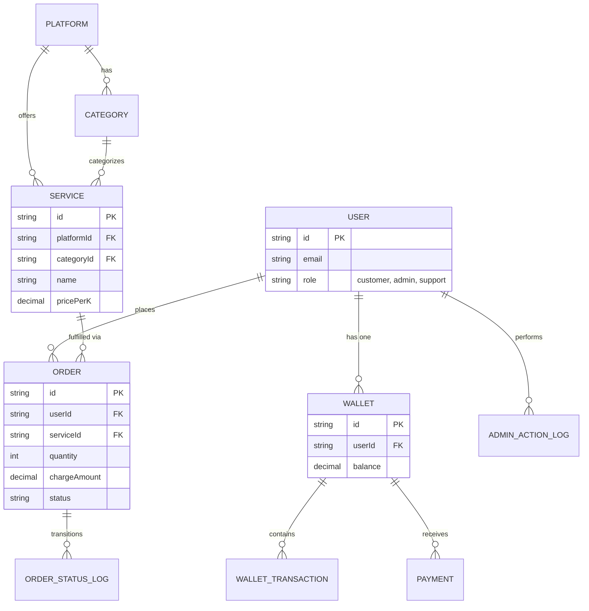

# Database Architecture

## 1. Schema Overview

The Nexora database is built using PostgreSQL and managed exclusively via **Prisma ORM**. The schema is strictly typed, utilizes cascading deletes where safe, and indexes critical columns for optimized reads on massive datasets (such as order status tables).

### Entity Relationship Diagram

## 2. Core Entities Details

### 2.1 Identity & Financial Ledger
- **User:** The base authentication entity. Roles control authorization across the platform.
- **Wallet:** A 1:1 mapped financial ledger for each user.
- **WalletTransaction:** Immutable records forming a double-entry style accounting ledger for the Wallet. Transactions are typed as `deposit`, `charge`, `refund`, or `adjustment`.
- **Payment:** Records metadata explicitly tied to external payment providers (like Stripe Checkout Session IDs).

### 2.2 Service Catalog
- **Platform:** High-level groupings (e.g., Instagram, TikTok, YouTube).
- **Category:** Sub-groupings within a Platform (e.g., Followers, Likes, Views).
- **Service:** The specific SKU. Contains billing logistics like `pricePerK` (price per 1000 items), `minOrder`, `maxOrder`, and the crucial `providerServiceId` bridging internal limits with external API execution.

### 2.3 Order Execution & Support
- **Order:** Tracks an active purchase. Encompasses target URLs, quantities, costs, and current state.
- **OrderStatusLog:** An append-only historical log of the Order as it transverses states (`pending` -> `queued` -> `processing` -> `completed`).

### 2.4 System Operations
- **QueueJobLog:** Internal tracing for executed BullMQ tasks, particularly external API invocations.
- **AdminActionLog:** Audit trails tracking state mutations executed by staff members.
