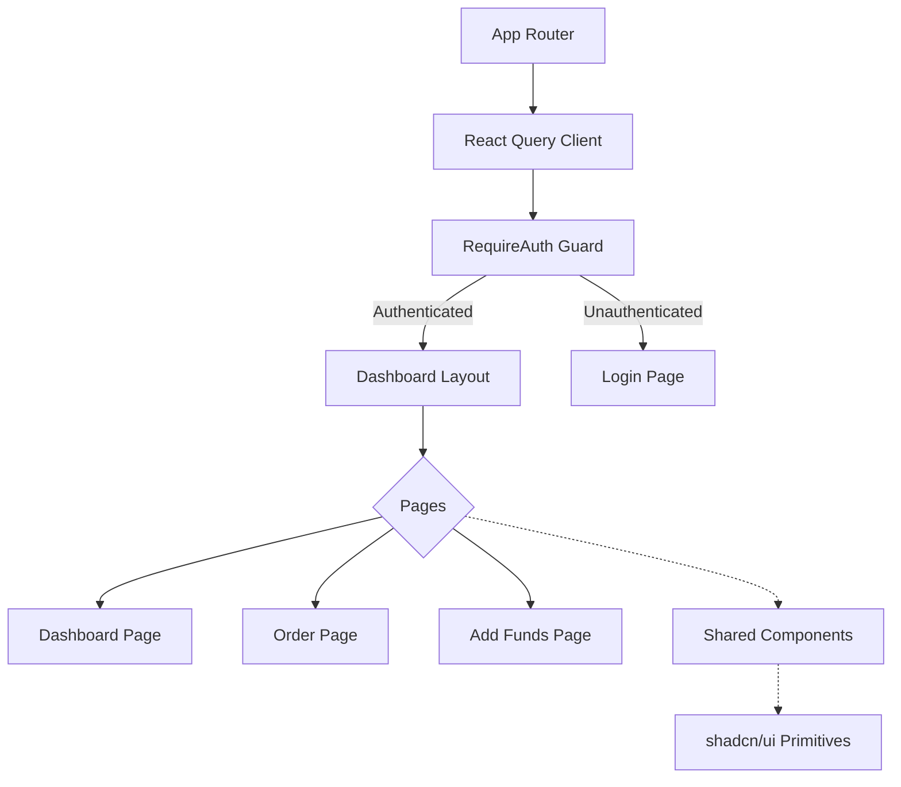
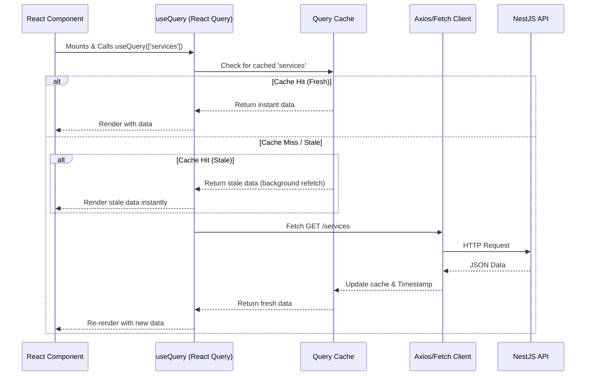

# Frontend Architecture

## 1. Overview

The Nexora frontend is built as a highly reactive Single Page Application (SPA). It favors strict typing, atomic component structures, and declarative data synchronization.

**Core Stack:**
- **Framework:** React 18
- **Build Tool / Bundler:** Vite
- **Language:** TypeScript
- **Styling Strategy:** Tailwind CSS + Radix/shadcn UI Primitives

## 2. System Structure

```
src/
├── components/      # Reusable UI elements
│   ├── ui/          # Standardized atoms (Buttons, Inputs, Dialogs via shadcn)
│   └── ...          # Composite elements (BrandLogo, Header, Footer, RequireAuth)
├── data/            # Static constants / Mock services abstractions
├── hooks/           # Custom React hooks
├── lib/             # Utility toolkits (Tailwind merge wrappers, formatters)
└── pages/           # High-level route views (Dashboard, Order, AddFunds)
```

### 2.1 Component Hierarchy Diagram



## 3. Key Paradigms

### 3.1 Styling & UI Library
The platform utilizes **shadcn/ui**. Unlike traditional component libraries (like MUI or AntDesign), shadcn provides the raw code of the components directly into the `src/components/ui` folder. This gives complete structural ownership.
- **Tailwind CSS** handles the atomic styling, driven by a centralized `tailwind.config.ts`.
- `clsx` and `tailwind-merge` are utilized to gracefully compose and override conditional CSS classes.

### 3.2 Data Fetching & State Synchronization

The application establishes a clear boundary between Server State (persisted data) and Client State (UI layout, toggles).



- **React Query (Server State):** Manages asynchronous remote state. It handles caching, deduplication, and background refetching automatically. Queries are strictly keyed (e.g., `['user', 'wallet']`) allowing precise cache invalidations without full page reloads.
- **Local State (Client State):** Handled natively via `useState` or Context API for extremely localized transient state (e.g., modal visibility, form multi-step indices).
- **Forms & Validation:** Handled exclusively via `react-hook-form` connected to `zod` schema resolvers. This ensures zero uncontrolled re-renders and strictly typed validation structures propagating right back to the API.

### 3.3 Routing Strategy
Managed via `react-router-dom` using declarative `<Route>` structures.
- **Authentication Guards:** The `<RequireAuth>` wrapper component securely wraps private dashboards. It verifies session contexts before rendering the sub-tree, otherwise triggering an immediate redirect to `/login`.

### 3.4 Animations
Micro-interactions are governed by `framer-motion` (`motion.div`), providing fluid spring physics to dialog opens, page transitions, and toast notifications without dropping frames.
