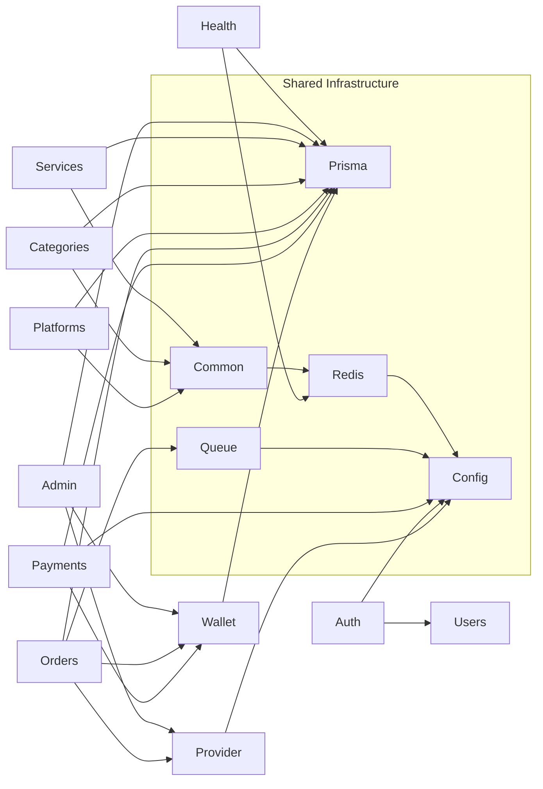
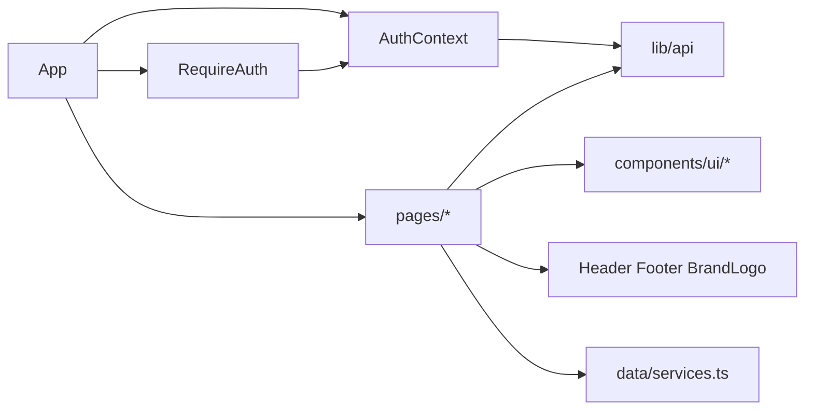

# Module Dependency Map

This document maps how the major frontend and backend modules depend on each other today.

## Backend Dependency Graph



## Backend Module Details

### `CommonModule`

- Provides:
  - `AppLogger`
  - `CacheService`
  - `RateLimitService`
  - `RateLimitGuard`
- Dependents:
  - catalog modules use `CacheService`
  - auth and payments controllers use `RateLimitGuard`
  - app bootstrap uses `AppLogger`

### `ConfigModule`

- Central env and Joi validation module.
- Implicitly consumed across:
  - auth
  - payments
  - provider
  - redis
  - queue
  - app bootstrap

### `UsersModule`

- Lowest-level user persistence helper.
- Depended on by:
  - `AuthModule`

### `AuthModule`

- Depends on:
  - `UsersModule`
  - JWT config
  - Passport
- Used by:
  - protected controllers through `JwtAccessGuard`
  - admin access through `RolesGuard`

### `WalletModule`

- Depends on:
  - `PrismaModule`
- Used by:
  - `OrdersModule`
  - `PaymentsModule`
  - `AdminModule`

This is the core financial consistency module.

### `PaymentsModule`

- Depends on:
  - `WalletModule`
  - `PrismaModule`
  - `ConfigModule`
- External integration:
  - Stripe

Notable coupling:

- tightly coupled to wallet credit semantics,
- intentionally decoupled from frontend redirect success,
- owns webhook idempotency.

### `ProviderModule`

- Depends on:
  - `ConfigModule`
- External integration:
  - provider HTTP API via Axios

Used by:

- `OrdersModule`
- `AdminModule`

### `OrdersModule`

- Depends on:
  - `WalletModule`
  - `ProviderModule`
  - `PrismaModule`
  - BullMQ queues

Internal structure:

- controller for HTTP endpoints
- service for validation and transactions
- submit processor for provider creation
- status-update processor for polling

This is the most orchestrated module in the system.

### Catalog Modules

- `PlatformsModule`
- `CategoriesModule`
- `ServicesModule`

Dependencies:

- `PrismaModule`
- `CommonModule` for Redis-backed caching

These modules are read-heavy and intentionally simple.

### `AdminModule`

- Depends on:
  - `PrismaModule`
  - `WalletModule`
  - `ProviderModule`
  - auth guards and roles

Notable coupling:

- writes to many domain areas,
- serves as the system operator surface,
- logs actions to `AdminActionLog`.

### `HealthModule`

- Depends on:
  - Prisma
  - Redis connection

This module crosses infrastructure boundaries by design.

## Backend Cross-Cutting Dependencies

### Security path

```text
Request
-> JwtAccessGuard / RolesGuard / RateLimitGuard
-> ValidationPipe
-> Controller
-> Service
-> Prisma / Redis / Provider / Stripe
```

### Persistence path

```text
Controllers do not write directly to Prisma.
All domain writes flow through services.
Most domain services return transport-ready DTO-like objects.
```

### Queue path

```text
OrdersService
-> BullMQ enqueue
-> OrdersSubmitProcessor
-> ProviderService.createOrder
-> OrdersStatusUpdateProcessor
-> ProviderService.getOrderStatus
```

## Frontend Dependency Graph



## Frontend Module Details

### `src/App.tsx`

- Root composition module.
- Depends on:
  - React Query provider
  - auth provider
  - router
  - toast providers

### `src/context/AuthContext.tsx`

- Depends on:
  - `src/lib/api.ts`
  - localStorage session persistence

Provides:

- authenticated user state
- access token
- login/register/logout
- refreshProfile

### `src/lib/api.ts`

- Lowest-level frontend network dependency.
- Used by:
  - `AuthContext`
  - dashboard/order/catalog/payment pages

Notable behavior:

- automatic refresh-token retry
- stores session under `nexora-session`

### Route pages

- `Index.tsx`
  - mostly presentation and fallback content
- `Services.tsx`
  - depends on API and fallback catalog data
- `ServiceDetails.tsx`
  - depends on API, fallback catalog data, auth state, localStorage draft
- `Order.tsx`
  - depends on auth, API, fallback catalog data, localStorage draft
- `Dashboard.tsx`
  - depends on authenticated API calls
- `AddFunds.tsx`
  - depends on authenticated API calls and Stripe redirect URL

## Coupling Observations

### 1. Frontend data fetching is page-centric

Pages fetch directly with `apiRequest` or `apiRequestWithRefresh`.

Implication:

- easy to understand locally,
- harder to reuse query logic,
- React Query is underused despite being installed and mounted.

### 2. Wallet logic is centralized correctly

All wallet credits and debits pass through `WalletService`.

Implication:

- strong consistency point,
- easier to audit,
- easier to protect against overdrafts and duplicate crediting.

### 3. Orders are the orchestration hub

`OrdersService` and the two processors coordinate:

- catalog constraints,
- wallet debit,
- queueing,
- provider submission,
- provider status syncing.

Implication:

- this module carries the most business complexity,
- it is the highest-value place for automated tests.

### 4. Admin is intentionally broad

`AdminService` touches services, provider sync, orders, payments, and wallet adjustments.

Implication:

- good operational leverage,
- but it is also a natural hotspot for future policy and audit requirements.

### 5. Cache invalidation is weak

Catalog reads are cached through Redis, but service create/update flows do not explicitly clear related cache keys.

Implication:

- admin changes may not appear immediately,
- current freshness depends on TTL expiry.

## Suggested Future Refactors

### Frontend

- Introduce `catalogApi`, `ordersApi`, `paymentsApi`, and React Query hooks.
- Move route pages toward orchestration-only responsibilities.

### Backend

- Separate worker bootstrap from API bootstrap if scaling needs grow.
- Add cache invalidation hooks for catalog writes.
- Add tests around:
  - wallet concurrency,
  - Stripe webhook idempotency,
  - order queue rollback and refund paths.
