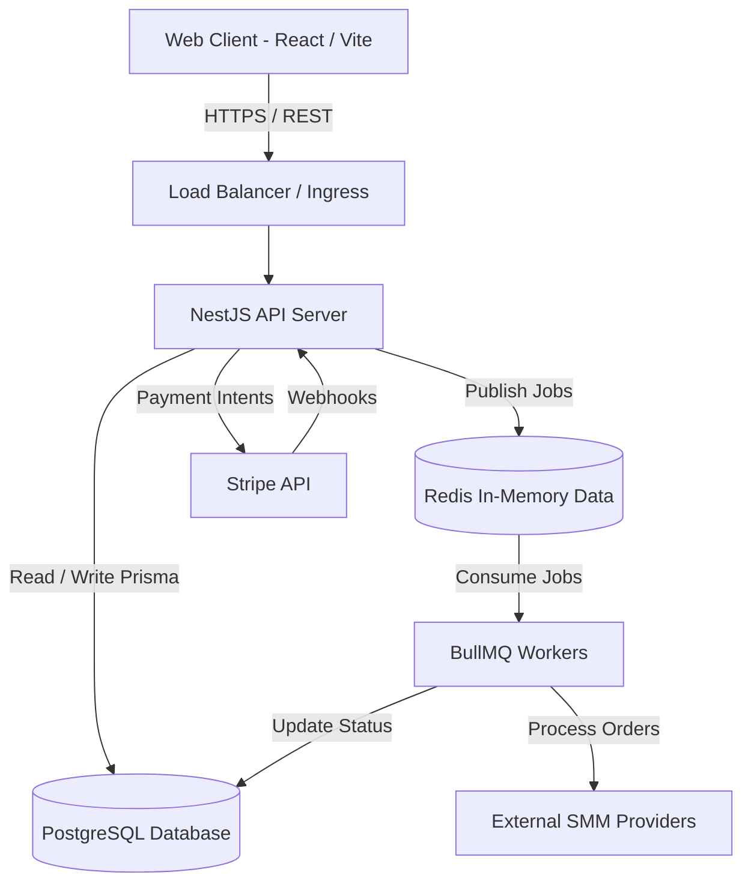

# System Overview

## 1. Introduction

The **Nexora Platform** is structured as a decoupled client-server architecture. This design allows dedicated scalability, rapid feature deployment, and a clear separation of concerns between the presentation layer and core business logic.

## 2. High-Level Architecture Component

## 3. Core Components

### 3.1. Frontend Web App (Client)
- **Role:** Handles presentation, user input, client-side routing, and caching.
- **Tech Stack:** React 18, Vite, TypeScript, Tailwind CSS, shadcn/ui.

### 3.2. Core API (Backend)
- **Role:** Central orchestrator for the platform. Manages state, handles business logic, interfaces with the database, validates incoming requests, and handles authentication.
- **Tech Stack:** NestJS (Node.js framework), TypeScript.

### 3.3. Database (Persistence)
- **Role:** Relational persistence of all entities (Users, Orders, Transactions, Tickets).
- **Tech Stack:** PostgreSQL mapped via Prisma ORM.

### 3.4. Asynchronous Workers & Queue
- **Role:** Dedicated processes for handling heavy lifting asynchronously to ensure API response times remain instantaneous.
- **Tasks handled:** Webhook ingestion, background order fulfillment via third-party providers, and periodic status syncs.
- **Tech Stack:** Redis and BullMQ.

### 3.5. External Integrations
- **Stripe:** Exclusively handles payment processing and secure checkout sessions.
- **SMM Providers:** External APIs that the workers communicate with to deliver digital growth services.
